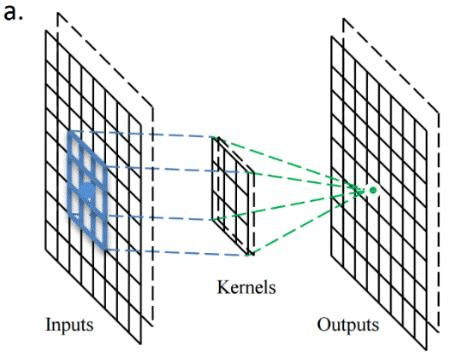
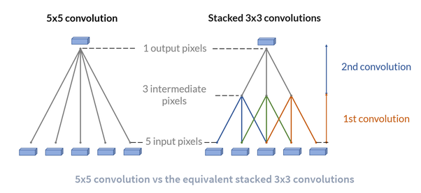
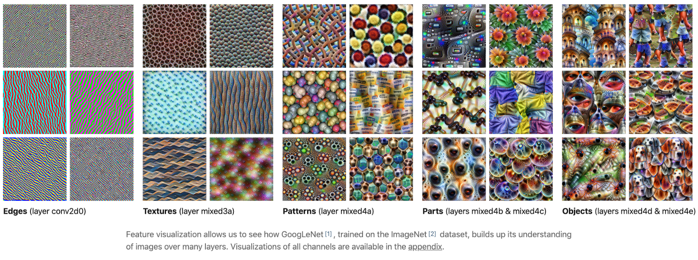

# Basic of Computer Vision

## Contributer
* [Ammar Adil](https://github.com/adilsammar)
* [Krithiga](https://github.com/BottleSpink)
* [Shashwat Dhanraaj](https://github.com/sdhanraaj12)
* [Srikanth Kandarp](https://github.com/Srikanth-Kandarp)

### What are Channels and Kernels? 

In this picture on the left hand side we have an input, this input image is passed through a process called convolution. In the process we use a matrix which is called kernel or feature exteractor or filter. The role of this matrix is to pass selective information and leave the rest. 

On the right hand side what you see is an output of convolution process, which can also be called as channel or a set of channels. This output contains similar or a specific kind of information (features, shapes, texture, colour, gradient, curves, edges, patterns, objects). 

You can visualize a channel but not a kernel

### Why should we (nearly) always use 3x3 kernels?

Lets look at this image, it shows a comparison between 3\*3 and 5\*5 kernel

1. Looking at this picture it is evidnt that we can reach at any size kernel using a 3 * 3 kernel
2. Using a 5x5 filter implies we need 5 * 5 = 25 unique weight parameters [i.e. we slide a single filter with 25 weights], but using two 3 * 3 filter 2 * (3*3) or (9+9) unique weight parameters are needed [here, the first filter is slid with 9 weights, which creates a new layer. Then a second filter with 9 weights is slid across the new layer. Its a series of convolutions]. Therefore, as we can see while performing forward pass & back-propagation, the number of weights (used & updated) are reduced from 25 to 18. Hence a reduction in computation.
3. Nvidia GPU's which is predominately used for training DNN models are also optimized for 3*3 size kernels which gives an edge over the time and resource used in training.

### How many times do we need to perform 3x3 convolutions operations to reach close to 1x1 from 199x199 (type each layer output like 199x199 > 197x197...)

We need to perform 99 convolution operation to reach 1x1 from 199x199

1.	199x199 > 197x197
2.	197x197 > 195x195
3.	195x195 > 193x193
4.	193x193 > 191x191
5.	191x191 > 189x189
6.	189x189 > 187x187
7.	187x187 > 185x185
8.	185x185 > 183x183
9.	183x183 > 181x181
10.	181x181 > 179x179
11.	179x179 > 177x177
12.	177x177 > 175x175
13.	175x175 > 173x173
14.	173x173 > 171x171
15.	171x171 > 169x169
16.	169x169 > 167x167
17.	167x167 > 165x165
18.	165x165 > 163x163
19.	163x163 > 161x161
20.	161x161 > 159x159
21.	159x159 > 157x157
22.	157x157 > 155x155
23.	155x155 > 153x153
24.	153x153 > 151x151
25.	151x151 > 149x149
26.	149x149 > 147x147
27.	147x147 > 145x145
28.	145x145 > 143x143
29.	143x143 > 141x141
30.	141x141 > 139x139
31.	139x139 > 137x137
32.	137x137 > 135x135
33.	135x135 > 133x133
34.	133x133 > 131x131
35.	131x131 > 129x129
36.	129x129 > 127x127
37.	127x127 > 125x125
38.	125x125 > 123x123
39.	123x123 > 121x121
40.	121x121 > 119x119
41.	119x119 > 117x117
42.	117x117 > 115x115
43.	115x115 > 113x113
44.	113x113 > 111x111
45.	111x111 > 109x109
46.	109x109 > 107x107
47.	107x107 > 105x105
48.	105x105 > 103x103
49.	103x103 > 101x101
50.	101x101 > 99x99
51.	  99x99 > 97x97
52.	  97x97 > 95x95
53.	  95x95 > 93x93
54.	  93x93 > 91x91
55.	  91x91 > 89x89
56.	  89x89 > 87x87
57.	  87x87 > 85x85
58.	  85x85 > 83x83
59.	  83x83 > 81x81
60.	  81x81 > 79x79
61.	  79x79 > 77x77
62.	  77x77 > 75x75
63.	  75x75 > 73x73
64.	  73x73 > 71x71
65.	  71x71 > 69x69
66.	  69x69 > 67x67
67.	  67x67 > 65x65
68.	  65x65 > 63x63
69.	  63x63 > 61x61
70.	  61x61 > 59x59
71.	  59x59 > 57x57
72.	  57x57 > 55x55
73.	  55x55 > 53x53
74.	  53x53 > 51x51
75.	  51x51 > 49x49
76.	  49x49 > 47x47
77.	  47x47 > 45x45
78.	  45x45 > 43x43
79.	  43x43 > 41x41
80.	  41x41 > 39x39
81.	  39x39 > 37x37
82.	  37x37 > 35x35
83.	  35x35 > 33x33
84.	  33x33 > 31x31
85.	  31x31 > 29x29
86.	  29x29 > 27x27
87.	  27x27 > 25x25
88.	  25x25 > 23x23
89.	  23x23 > 21x21
90.	  21x21 > 19x19
91.	  19x19 > 17x17
92.	  17x17 > 15x15
93.	  15x15 > 13x13
94.	  13x13 > 11x11
95.	  11x11 > 9x9
96.	  9x9 > 7x7
97.	  7x7 > 5x5
98.	  5x5 > 3x3
99.	  3x3 > 1x1

### How are kernels initialized? 

Kernels are assigned randomly from a set of numbers (random). There is a obvious question which comes to mind   *Can we not assign kernels with either all 1's or 0's?* 

1. Kernels are filters which work over the input image and gives out channels as output. If we have all values as 0s, all the convolution operation that will take place will be 0. Lets take an Example of Filtering Tea: All 0s means the filter does not have opening to filter the tea from tea leaves. Hence when we pour our tea via that filter we will get nothing.
2. If we initialize all kernel values with 1, we will have identical kernels giving same channels as output. The task of the kernel should be to separate, where as if we have same filters it will produce same results. For example: if the filter used to separate tea from tea leaves is open (no nets), it will give the same unfiltered tea back.

### What happens during the training of a DNN?

During the training, the base layer neurons store all the pixels of image/input.

In each layer, there is a kernel that extracts features or combines low-level features to give high-level features.
Kernel values are initialized randomly, then, during the training, the model learns and corrects these values based on the features it intends to extract.

* 1st layer combines pixels to detect edges
* 2nd layer combines edges to make textures, gradients
* 3rd layer combines textures to make patterns
* 4th layer combines patterns to make parts of objects
* 5th layer combines parts of objects to make objects
* Finally, the name/type of object is predicted