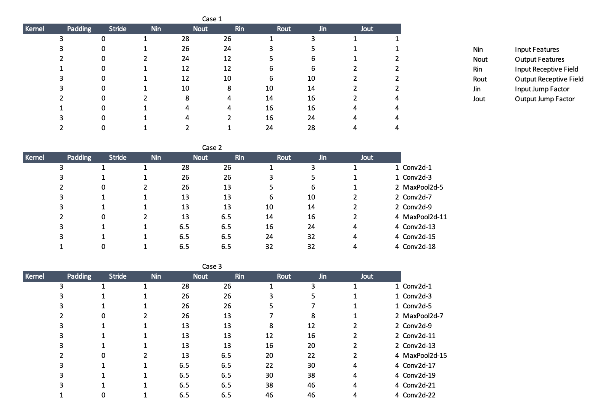

# Assignment 5 (Coding Drill Down)
### Contributers
* [Ammar Adil](https://github.com/adilsammar)
* [Krithiga](https://github.com/BottleSpink)
* [Shashwat Dhanraaj](https://github.com/sdhanraaj12)
* [Srikanth Kandarp](https://github.com/Srikanth-Kandarp)

----
### Summary 

Target is to reach an optimal network for MNIST dataset which can show test accuracy of more than 9.4 and with least possible params.

At the end of this excercise we will reach **99.45** with **5.7k** params

### Case 1

  * #### [Notebook Link](../notebook/Case1.ipynb)
  * #### Target 
    Basic Network
  * #### Results
    ```
    16,530 Parameters
    Best Train Accuracy: 99.26
    Best Test Accuracy: 98.92
    ```
  * #### Analysis
    Model has decent parameters but overfitting can be seen happening after epoch 8

---
### Case 2

  * #### [Notebook Link](../notebook/Case2.ipynb)
  * #### Target 

     * Lighter model
     * Reduce overfitting
     * Increase Model efficiency with Batch Normalization
     * Use GAP
  * #### Results
    ```
    4,838 Parameters
    Best Train Accuracy: 98.98
    Best Test Accuracy: 98.9
    ```
  * #### Analysis

    * Model's parameters are brought down
    * Overfitting has reduced though not completely
    * Accuracy is still around 98

---
### Case 3

  * #### [Notebook Link](../notebook/Case2.ipynb) / [Weights](../weight/model_weights_99.45.pth)
  * #### Target
    * Reduce overfitting - Augmentation
    * Learning rate optimization
    * Increase accuracy

  * #### Results
    ```
    5,760 Parameters (Changed the network)
    Best Train Accuracy: 99.02
    Best Test Accuracy: 99.45
    ```
  * #### Analysis
    * Introduced transformations like ShiftScaleRotate, RandomCrop, and RandomBrightness from albumentations library to reduce the overfitting further
    * Used LR scheduler to define a search space -> (0.01 - 0.1)


### Receptive Field Calculation
  
<center>



</center>
