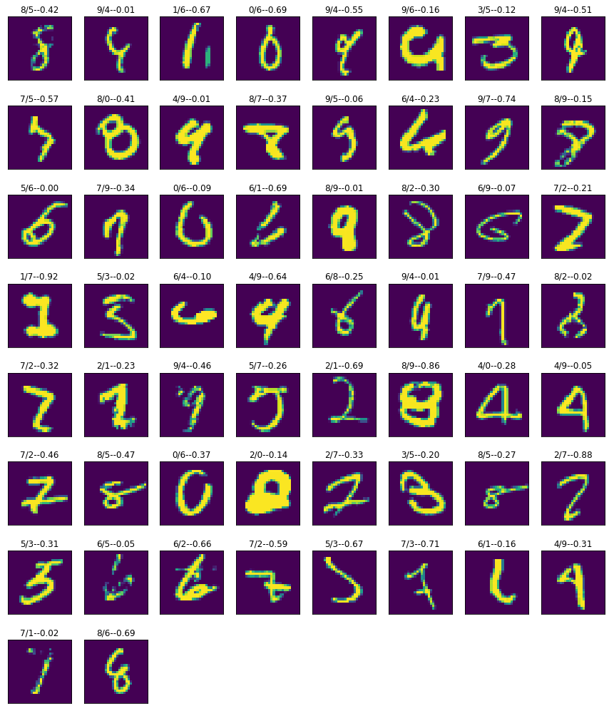

# In this article we will walk you through how to create MNIST digit dataset classifier

The target is to achieve it in under 5k params with accuracy more than 99.40

### Contributer
* [Ammar Adil](https://github.com/adilsammar)
* [Krithiga](https://github.com/BottleSpink)
* [Shashwat Dhanraaj](https://github.com/sdhanraaj12)
* [Srikanth Kandarp](https://github.com/Srikanth-Kandarp)

### Before we start Remember, `Good news will come only after your training loop ends` So Just Wait


## Table of Contents  
* [Motivation](#moivation-to-keep-you-engaged-till-the-end)
* [Basics](#baics)  
* [Data Loader](#data-loader)
* [Data Visualization](#data-visualization)
* [Network Design](#network-design)
* [Training](#training)
* [Analysis](#analysis)


## Moivation to keep you engaged till the end

Accuracy achieved: `99.42` within `10 epochs` with `4838` params used

Code Link: [Local NoteBook](../notebook/MNIST_4838_9942.ipynb) / [CoLab Notebook](https://colab.research.google.com/drive/1uIfwHwPRwB-2jYiiTi9kksbGuU6J0B_8?usp=sharing)


## Basics
Before we can even start talking about machine learning, model or training we need to know what kind of problem we are trying to solve here. For us the problem in hand is classifying a digit image into its respective class (ie what digit a given image belongs to).

## Data Loader
To start with, the first thing we have to do is to load data. As we are working with `PyTorch`, there is an inbuilt functionality which helps us load data as shown below


    batch_size = 64

    train_loader = torch.utils.data.DataLoader(
        datasets.MNIST('../data', train=True, download=True,
                    transform=transforms.Compose([
                        transforms.ToTensor(),
                        transforms.Normalize((0.1307,), (0.3081,))
                    ])),
    batch_size=batch_size, shuffle=True)

    test_loader = torch.utils.data.DataLoader(
        datasets.MNIST('../data', train=False, transform=transforms.Compose([
                            transforms.ToTensor(),
                            transforms.Normalize((0.1307,), (0.3081,))
                        ])),
        batch_size=batch_size, shuffle=True)


this will load mnist data and convert it into `data loader`. DataLoader is a built in class which provides an iterator to loop over, one of the parameter this takes in is batch size which used for `minibatch` gradient descent while training.

## Data Visualization
Before we even stat with creating our model we have to look into what kinbd of data we are dealing with for this we use `matplotlib` to visualize our data. We will print some samples to see how they look.


As we can see from above image datasamples are all approximately centerred.

One of the other thing we need to look into our dataset is the class spread. For this we visualize our training dataset to know count of datasamples in each class.

    {0: 5923, 1: 6742, 2: 5958, 3: 6131, 4: 5842, 5: 5421, 6: 5918, 7: 6265, 8: 5851, 9: 5949}


From this chart we can clearly see data is evenly spread around all classes, what we can conclude from here is while training our network will not be baised to one class.

## Network Design

Designing a network is an art and an iterative process. And we dont want you to go through that pain. So we are haring some tips and tricks to design a network.

But before we jump into network architecture we like to point out some of golden rules to design any network.

1. There are two kind of network designs `Smooth Design` and `Stepped Design` as shown below. In this article we have used `Stepped Design`

    
    

2. Try to understand what should be the right size of network you need to start with, Tip: start with like large enough network with million of params, so that once you train, you know you have a right amount of data to solve your problem. Otherwise you go and collect more data.

3. Do not try every possible optimiztion in first iteration. Take one step at a time.

We will now spare you with too much of `GYAN` and quickly jump on to nework design used.


This network contains block pattern as shown. We start with an image of size 1\*28\*28

1. Block 1 -> Convolution with a kernel of size 4\*3\*3 and padding 1, we do two sets of such convolution
2. Transition layer -> Here we have used MaxPolling2D to reduce channel size by half, followed by dropout of 0.01
3. Block 2 -> Convolution with a kernel of size 8\*3\*3 and padding 1, we do two sets of such convolution
4. Transition layer -> Here we have used MaxPolling2D to reduce channel size by half, followed by dropout of 0.01
5. Block 2 -> Convolution with a kernel of size 16\*3\*3 and padding 1, we do two sets of such convolution
6. Transition layer -> A 1\*1 convolution is used to reduce channel from 16 to 10
7. Output layer -> GAP is used to convert every channel to 1\*1 and then passed to softmax

    ```
    ----------------------------------------------------------------
            Layer (type)               Output Shape         Param #
    ================================================================
                Conv2d-1            [-1, 4, 28, 28]              40
           BatchNorm2d-2            [-1, 4, 28, 28]               8
                Conv2d-3            [-1, 4, 28, 28]             148
           BatchNorm2d-4            [-1, 4, 28, 28]               8
             MaxPool2d-5            [-1, 4, 14, 14]               0
               Dropout-6            [-1, 4, 14, 14]               0
                Conv2d-7            [-1, 8, 14, 14]             296
           BatchNorm2d-8            [-1, 8, 14, 14]              16
                Conv2d-9            [-1, 8, 14, 14]             584
          BatchNorm2d-10            [-1, 8, 14, 14]              16
            MaxPool2d-11              [-1, 8, 7, 7]               0
              Dropout-12              [-1, 8, 7, 7]               0
               Conv2d-13             [-1, 16, 7, 7]           1,168
          BatchNorm2d-14             [-1, 16, 7, 7]              32
               Conv2d-15             [-1, 16, 7, 7]           2,320
          BatchNorm2d-16             [-1, 16, 7, 7]              32
              Dropout-17             [-1, 16, 7, 7]               0
               Conv2d-18             [-1, 10, 7, 7]             170
    AdaptiveAvgPool2d-19             [-1, 10, 1, 1]               0
    ================================================================
    Total params: 4,838
    Trainable params: 4,838
    Non-trainable params: 0
    ----------------------------------------------------------------
    Input size (MB): 0.00
    Forward/backward pass size (MB): 0.20
    Params size (MB): 0.02
    Estimated Total Size (MB): 0.22
    ----------------------------------------------------------------
    ```


As we can see from network summary total number of params used are `4838`

Receptive Field Calcultion

* Block 1
	* Conv -> 3\*3 -> 3\*3
	* Conv -> 3\*3 -> 5\*5

* Transition
	* MP -> 10\*10

* Block 2 
	* Conv -> 3\*3 -> 12\*12
	* Conv -> 3\*3 -> 14\*14

* Transition
	* MP -> 28\*28

* Block 3
	* Conv -> 3\*3 -> 30\*30
	* Conv -> 3\*3 -> 32\*32


## Training

Training is the most critical part of ml lifecycle.

There are some thumb rule to ace this step

1. Start training with a lower learning rate
2. Train for some 15 epochs and see model performance if your model is not converging that for sure your model will not converge even if yout train for further epochs
3. Always make sure there is a small gap between train and test accuracies. If your train accuracy is very high and test is low for sure your network is overfitting. This is when you have to add some regularization to your network. There are certain techniques to add regularization. Following are the one we have used in our network
    1. Data Augumentation
        1. Random Rotation: Each data input will be randomly rotated by certain angle.
        2. Random Resized Crop: Each data input will be cropped randomly and resized to original image size
    2. Dropout: This is a techinque which is used to force network to learn non prominent features from input data, by randomly dropping channels or pixels from your network.

We will Quickly jump into training logs for this network we have trained.

```
Using Device: cuda
Epochs: 12
Lr: 0.001
Max Lr: 0.01
Batch Size: 64


Epoch: 01
	 Learning Rate: 0.001000
	          Time: 0m 8s
	    Train Loss: 0.625474
	Train Accuracy: 49858/60000 | Percent: 83.10%
	     Val. Loss: 0.162506
	  Val Accuracy:  9556/10000 | Percent: 95.56%
Epoch: 02
	 Learning Rate: 0.005500
	          Time: 0m 8s
	    Train Loss: 0.141658
	Train Accuracy: 57536/60000 | Percent: 95.89%
	     Val. Loss: 0.072401
	  Val Accuracy:  9770/10000 | Percent: 97.70%
Epoch: 03
	 Learning Rate: 0.010000
	          Time: 0m 7s
	    Train Loss: 0.099431
	Train Accuracy: 58192/60000 | Percent: 96.99%
	     Val. Loss: 0.062662
	  Val Accuracy:  9820/10000 | Percent: 98.20%
Epoch: 04
	 Learning Rate: 0.006733
	          Time: 0m 8s
	    Train Loss: 0.068084
	Train Accuracy: 58752/60000 | Percent: 97.92%
	     Val. Loss: 0.067833
	  Val Accuracy:  9795/10000 | Percent: 97.95%
Epoch: 05
	 Learning Rate: 0.003467
	          Time: 0m 8s
	    Train Loss: 0.051231
	Train Accuracy: 59044/60000 | Percent: 98.41%
	     Val. Loss: 0.030389
	  Val Accuracy:  9905/10000 | Percent: 99.05%
Epoch: 06
	 Learning Rate: 0.000200
	          Time: 0m 8s
	    Train Loss: 0.041621
	Train Accuracy: 59252/60000 | Percent: 98.75%
	     Val. Loss: 0.023273
	  Val Accuracy:  9934/10000 | Percent: 99.34%
Epoch: 07
	 Learning Rate: 0.000171
	          Time: 0m 8s
	    Train Loss: 0.037224
	Train Accuracy: 59311/60000 | Percent: 98.85%
	     Val. Loss: 0.023017
	  Val Accuracy:  9932/10000 | Percent: 99.32%
Epoch: 08
	 Learning Rate: 0.000143
	          Time: 0m 8s
	    Train Loss: 0.037453
	Train Accuracy: 59294/60000 | Percent: 98.82%
	     Val. Loss: 0.021877
	  Val Accuracy:  9942/10000 | Percent: 99.42%
Epoch: 09
	 Learning Rate: 0.000114
	          Time: 0m 8s
	    Train Loss: 0.037043
	Train Accuracy: 59304/60000 | Percent: 98.84%
	     Val. Loss: 0.022108
	  Val Accuracy:  9934/10000 | Percent: 99.34%
Epoch: 10
	 Learning Rate: 0.000086
	          Time: 0m 8s
	    Train Loss: 0.035927
	Train Accuracy: 59306/60000 | Percent: 98.84%
	     Val. Loss: 0.021706
	  Val Accuracy:  9935/10000 | Percent: 99.35%
Epoch: 11
	 Learning Rate: 0.000057
	          Time: 0m 8s
	    Train Loss: 0.036654
	Train Accuracy: 59334/60000 | Percent: 98.89%
	     Val. Loss: 0.021196
	  Val Accuracy:  9940/10000 | Percent: 99.40%
Epoch: 12
	 Learning Rate: 0.000029
	          Time: 0m 8s
	    Train Loss: 0.034387
	Train Accuracy: 59344/60000 | Percent: 98.91%
	     Val. Loss: 0.021286
	  Val Accuracy:  9941/10000 | Percent: 99.41%
```


## Analysis

Best Validation Metrics

```
Val Accuracy: 9942/10000
     Percent: 99.42%
   Val. Loss: 0.021877
```

We need to analyse how is our network performing. The best way to do this is to plot different parameters and see.

1. Plot learning Rate
2. Plot train loss vs test loss per epoch
3. Plot train accuracy vs test accuracy per epoch

    

4. Plot confusion matrix

    

5. We will finally look at incorrectly classified images to see what went wrong and why

    