# In this article we will compare different normalization techniques

This file is submitted as part of Assignment 6 for EVA6 Course

## Table of Contents

* [Contributors](#Contributors)
* [Code Explanation](#Code-Explanation)
* [Consolidated Notebook](#Consolidated-Notebook)
* [Normalization Techniques Explained](#Normalization-Techniques-Explained)
* [Regularization](#Now-let's-about-the-Regressions)
* [Graphs](#Graphs)
* [Visualization for misclassified predictions](#Visualization-for-misclassified-predictions)
* [References](#References)

## Contributors

* [Ammar Adil](https://github.com/adilsammar)
* [Krithiga](https://github.com/BottleSpink)
* [Shashwat Dhanraaj](https://github.com/sdhanraaj12)
* [Srikanth Kandarp](https://github.com/Srikanth-Kandarp)

## Code Explanation

The codebase has been modularized and we have kept the below in separate python files

* [Dataset loader](https://github.com/adilsammar/woolly-of-cv/blob/main/assets/mnist/mnist/dataset.py)
  * Imported all necessary libraries for loading our data. Made custom data set MnistDataset.
  * Defined len and Getitem to get length of the dataset and read image and label from the dataset respectively. Applied transforms.
  * Defined a custom get_loader which can test and train data from transformed dataset in batch size of 64, using Cuda, by declaring train_loader and test_loader which can download the complete dataset from the Mnist server.
* [Model Architecture](https://github.com/adilsammar/woolly-of-cv/blob/main/assets/mnist/mnist/model.py)
  * Imported all necessary libraries for loading our data. 
  * Initialized Block and passed the arguments like Input Channel Size, Output Channel Size, padding(to be used for convolution layer, which defaults to 1. Type of normalization to be used. 
  * Allowed values like 'bn', 'gn', 'ln'. Where to Enable/Disable Maxpolling.
	Then passed the arguments like Input tensor to this block, Number of layers in this block.check for last block. then we return processed tensor. used relu
	Made a Network Class.
  * With arguments like Number of base channels to start with, number of Layers in each block, dropout value and normalization type. then how to convolve
  * Defined Convolution function with arguments like Input image tensor, where to enable/disable Dropout and then Return tensor of logits. then conv layer and output layer and also used Gap.
* [Data Transformations](https://github.com/adilsammar/woolly-of-cv/blob/main/assets/mnist/mnist/transform.py)
  * Imported all necessary libraries for loading our data plus albumentations library. 
  * Defined test transforms and traind transforms  with diffeerrent parameters like shift limit, scale limit, rotate limit, random rotation degree, img size, random crop percent and normalization with required mean and standard deviation 
* [Backpropagation](https://github.com/adilsammar/woolly-of-cv/blob/main/assets/mnist/mnist/backpropagation.py)
  * Imported all necessary libraries for loading our data. 
  * Created a train function to return train function instance by passing arguments related to l1. then defined a function for backpropagation and passed the arguments like model to be train, Data set to use for training, use optimizer, wherre to enable and disable dropouts, use cuda device and use cheduler instance which is used for updating lr while training.
  * Then return Loss and number of correct predictions.
	Defined test function to perform model validation by passing arguments like model instance to run validation, dataset used in validation, device type cuda and then return loss and number of correct predictions.
  * At last defined SGD optimizer.
* [LR Scheduler](https://github.com/adilsammar/woolly-of-cv/blob/main/assets/mnist/mnist/scheduler.py)
  * Imported all necessary libraries for loading our data. Defined a CustomOneCycleLR custom class for one cycle lr. 
  * Then Initialized Scheduler and passed the arguments like Optimizer to be used for training, Schedule to be used for training, Number of steps before changing lr value. 
  * Defined step( which calls every step to set next lr value. defined lr_schedules to get Next value for lr, then return LR value to use for next step.
  * Defined one_cycle_lr_pt to create instance of one cycle lr scheduler from python and passed the arguments like Optimizer to be used for Training, base lr value used, max lr value used in one cycle ly, Number of steps in each epochs, number of epochs for which training is done. Then return instance of one cycle lr scheduler.
  * Defined one_cycle_lr_custom which create instance of one cycle lr scheduler from python and passed arguments like Optimizer to be used for Training, base lr value used, max lr value used in one cycle ly, Number of steps in each epochs, number of epochs for which training is done.
  * Set raise Exception for epoch value < 12 and returns CustomOneCycleLR: instance of one cycle lr scheduler.
* [Visualization](https://github.com/adilsammar/woolly-of-cv/blob/main/assets/mnist/mnist/visualize.py)
  * Imported all necessary libraries for loading our data. Defined print_samples to Print samples input images, and passed arguments like loader:dataloader for training data and count:Number of samples to print.
  * Made a loop for Print Random Samples. 
	Defined a print_class_scale to Print Dataset Class scale with Argumnets like loader for Loader instance for dataset and class_map for mapping for class names. Then we plot the Bar Graph
  * Defined plot_confusion_matrix and passed arguments like Class lables, where to Enable/Disable Normalization, Title for plot, Colour Map, true label, predicted label etc to plot Confusion Matrix
  * Defined plot_incorrect_predictionsnd and passed arguments like List of all incorrect predictions, Lable mapping, Number of samples to print to plot Incorrect Predictions.
* [Utils](https://github.com/adilsammar/woolly-of-cv/blob/main/assets/mnist/mnist/utils.py)
  * Imported all necessary libraries for loading our data. Defined get_device to Get Device type and return Device type and use Cuda.
  * Defined print_summary to Print Model summary and passed the arguments like Model Instance and Input size
  * Defined print_modal_summary to Print Model summary and passed the arguments like Model Instance
  * Defined initialize_weights Function to initialize random weights with arguments m as Layer instance
  * Defined load_weights_from_path to load weights from file by passing arguments like Model instance and Path to weights file and then return loaded modal.
  * Defined get_all_predictions to Get All predictions for modelwith arguments like trained Model, Instance of dataloader, Which device to use cuda/cpu and Returns tuple of all predicted values and their targets
  * Defined get_incorrrect_predictions to Get all incorrect predictions by passing arguments like Trained model, instance of data loader, Which device to use cuda/cpu and then Return list of all incorrect predictions and their corresponding details
  * Defined prepare_confusion_matrix to Prepare Confusion matrix with arguments of List of all predictions, List of all actule labels and Class names and then return tensor of confusion matrix for size number of classes * number of classes


## Consolidated Notebook
The above files are used in the [Notebook](https://github.com/adilsammar/woolly-of-cv/blob/main/assets/mnist/notebook/MNIST_ALBUMENTATION_CONSOLIDATED.ipynb). This notebook is divided into four high level sections

* Data Loading:
  
  In this section we will use liberaries as explained above to load MNIST dataset and apply transformations

* Data Visualization:
  
  Here we will dig into dataset to understand its content for which we will plot two graphs class scale and random samples

* Training:
  
  We will create different instance of trainer with right params for three set of experiment
  * BatchNormalization + L1
  * GroupNormalization
  * Layer Normalization
  And then run all trainers to train these models

* Model Analysis:
  
  After training is completed we will look into model performance by printing comparison between models


  ##### Comparison
  
  The below graphs are from the experiments performed on the 3 normalization techniques that we discussed:

  Inference:
  * We see the batch normalization combined with the L1 performs better than Layer Normalization and almost on par with Group Normalization. Reasons could be:
    * Our network being small and batch size set to 32, BN+L1 works fine than the other two
    * Layers in the network is also small for layer normalization to perform better 
    * Group Normalization works well for the networks that are large
  * Group and layer normalization doesn't see any effect of Batch size
   
  * Consolidated graphs for all 3 Normalization:
   
  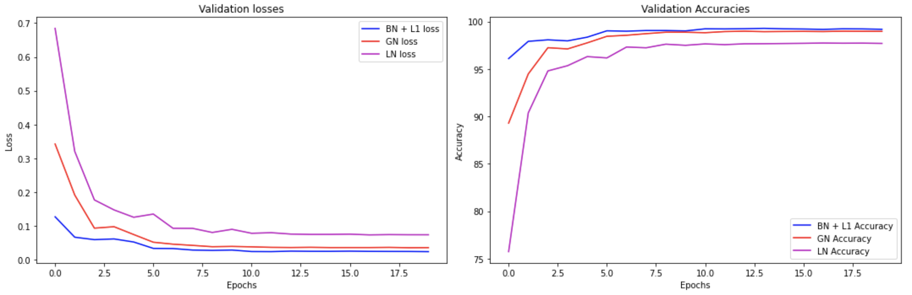
  
  * Training Validation Graphs for BN+L1
  
  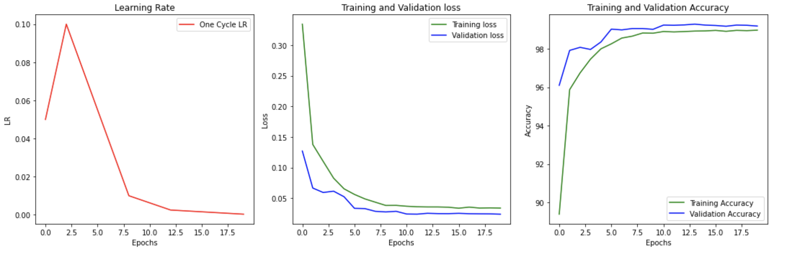
  
  * Training Validation Graphs for LN
  
  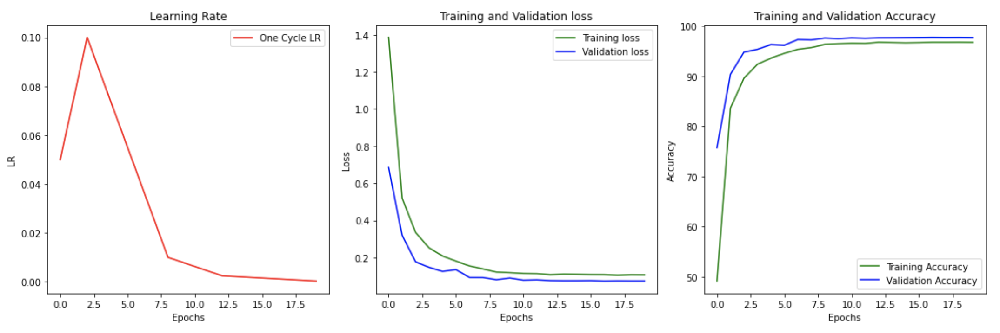
  
  * Training Validation Graphs for GN
  
  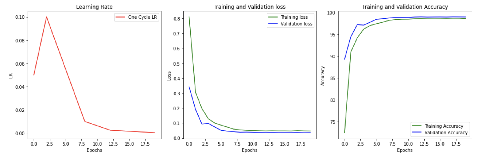
  
  
  ##### Visualization for misclassified predictions
  * Misclassified Predictions for Batch Normalization+L1:
  
    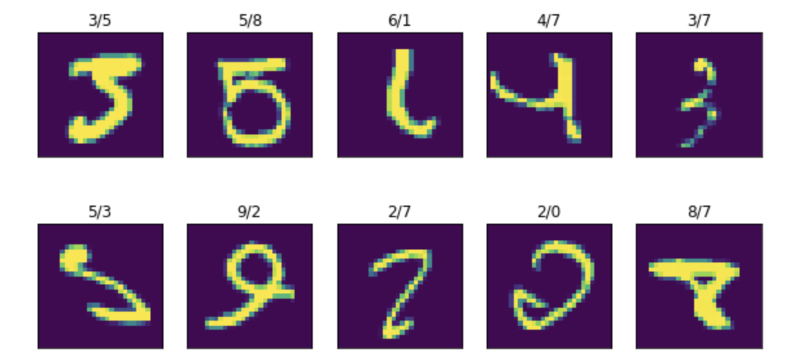
    
  * Misclassified Predictions for Layer Normalization:

    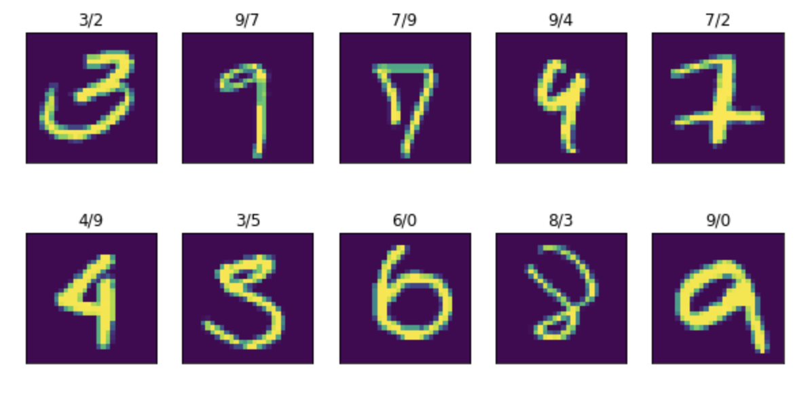
  
  * Misclassified Predictions for Group Normalization:

    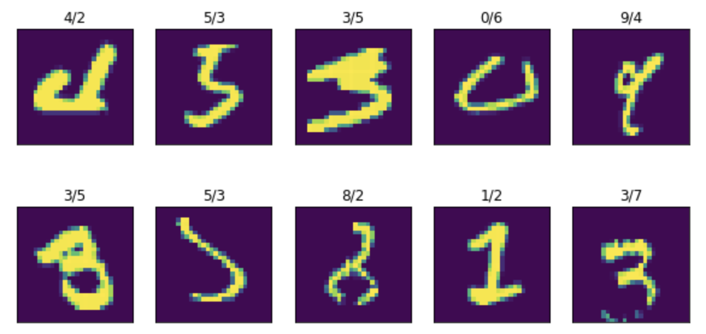
## Normalization Techniques Explained:
  
### What is Normalization: 
  
  Input data comes in different ranges and scales. Normalization helps to change their ranges and scales to bring uniformity to data. Eg: Input images can be standardized to range of [0,255] or [0,1]. For a grayscale image, '0' being black colour while '255' being white colour. 
  
      To convert a [-500, 1000] to 0-255. 

      Step 1: -500 can be brought to 0 by adding 500. That brings us to [0,1500]
      Step 2: Bring [0,1500] to [0,255] -> 255/1500.
  
  Normalization can also be defined as a transformation, which ensures that the transformed data has certain statistical properties like Mean close to 0, std.dev close to 1 and so on. 
  
  The below given diagram shows different transformation operations that can be performed on our data:
  
  >  * Centering: Ensures that the normalized output has a zero-mean property
  >  * Scaling: Ensures that the normalized output has a unit-variance property
  >  * Standardizing: Combines centering and scaling and ensures that the normalized output has zero-mean and unit-variance properties
  >  * Whitening: Ensures that the normalized output has a spherical Gaussian distribution
  >  * Decorrelating: Ensures that the correlation between different dimensions of the normalized output is zero 
  
  Source: https://arxiv.org/pdf/2009.12836.pdf
  
  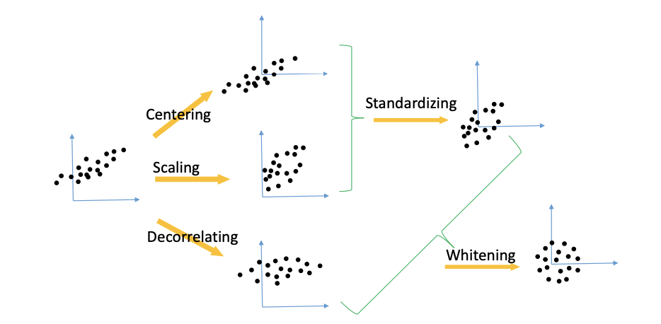

  Normalization can be applied at different levels. Below, we will take a look at the 3 normalization techniques.
  
### Batch Normalization:
  
  * What is Batch Normalization? 
  
    Making normalization a part of the model architecture and performing the normalization for each training mini-batch. 
    
    * Calculations for Batch Norm:
    
      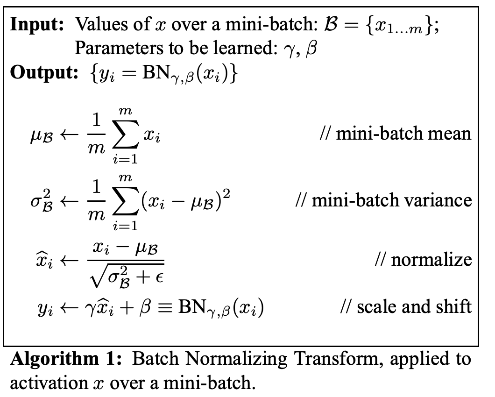
    
    * Batch Normalization in Network:
    
      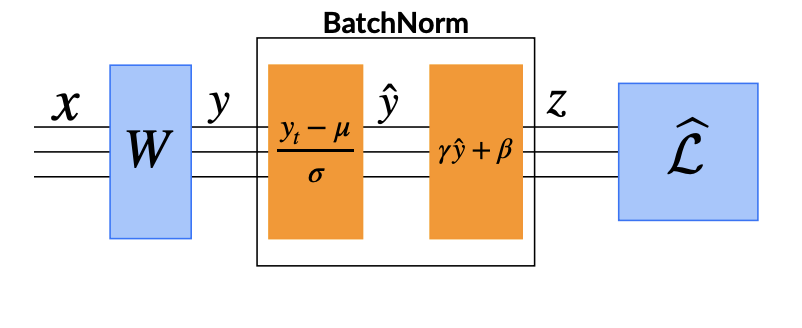
    
    * Why does it work? 
    
      Batch Normalization has been proved to be of help to reduce Internal Covariate Shift. 
  
  * What is Covariate Shift?
  
    The change in the distributions of layers’ inputs presents a problem because the layers need to continuously adapt to the new distribution. When the input distribution to a learning system changes, it is said to experience covariate shift.
    
    A layer with an activation function with u as the layer input, the weight matrix W and bias vector b. The model learns w,b at every backpropagation step making the gradient flowing down to u leading them to vanish and also it leads to slow convergence as the network depth increases. Also, the gradients with respect to the weights in one layer are highly dependent on the outputs of the neurons in the previous layer especially if these outputs change in a highly correlated way.The nonlinear inputs not remaining stable at different parts of the training is referred to as Covariate shift. By carefully initializing and by ensurinng small learning rate could solve this problem. However, this can also be solved by making the inputs to the activation more stable. 
  
  * Other advantages of BN:
  
    * Batch Normalization enables higher learning rates
    * Batch Normalization regularizes the model

### Layer Normalization:
  
  * What is Layer Normalization?
  
    Estimates the normalization statistics from the summed inputs to the neurons within a hidden layer so the normalization does not introduce any new dependencies between training cases as in the case of BN. For batch normalization, input values of the same neuron from different images in one mini batch are normalized whereas in layer normalization, input values for different neurons in the same layer are normalized without consideration of mini batch.
  
  * Why is it needed?
  
    * Originally introduced as BN was hard to apply to recurrent neural networks. The problem is RNNs have a recurrent connection to previous timestamps and would require a separate β and γ for each timestep in the BN layer which instead adds additional complexity and makes it harder to use BN with RNNs
    * Used in Transformers

### Group Normalization:
  
  * What is Group Normalization?
  
    Group Normalization divides the channels into groups and computes within each group the mean and variance for normalization. GN’s computation is independent of batch sizes, and its accuracy is stable in a wide range of batch sizes.
  
    Instead of normalizing across the batch dimension, GN normalizes across the groups formed from channels. One key hyperparameter in Group Normalization is the number of groups to divide the channels into.
  
  * Do we need this inspite of batch normalization?
  
    BN’s error increases rapidly when the batch size becomes smaller, caused by inaccurate batch statistics estimation. This is seen as a drawback in other CV tasks such as detection, segmentation, and video, which require small batches constrained by memory consumption.
  
    Source: https://arxiv.org/pdf/1803.08494.pdf
  
    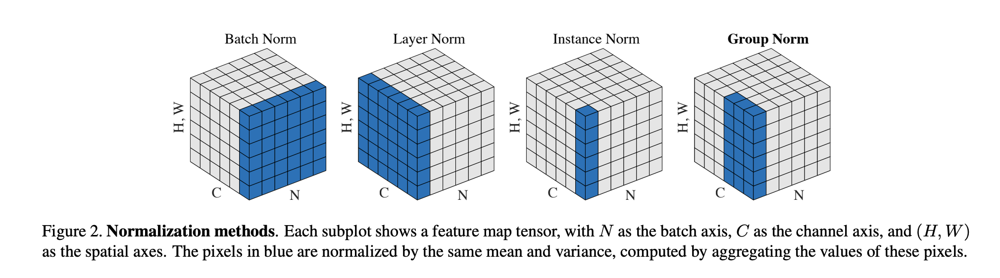
    
    Let’s consider that we have a batch of dimension (N, C, H, W) that needs to be normalized.
    
        N: Batch Size
        C: Number of Channels
        H: Height of the feature map
        W: Width of the feature map
    
    Essentially, in BN, the pixels sharing the same channel index are normalized together. That is, for each channel, BN computes the mean and std deviation along the (N, H, W) axes. As we can see, the group statistics depend on N, the batch size.

    In LN, the mean and std deviation are computed for each sample along the (C, H, W) axes. Therefore, the calculations are independent of the batch size.
    
    Finally, for group norm, the batch is first divided into groups. The batch with dimension (N, C, W, H) is first reshaped to (N, G, C//G, H, W) dimensions where G represents the number of groups. Finally, the mean and std deviation are calculated along the groups, that is (H, W) and along C//G channels. 
  
  * Group Normalization Calculation:
  
    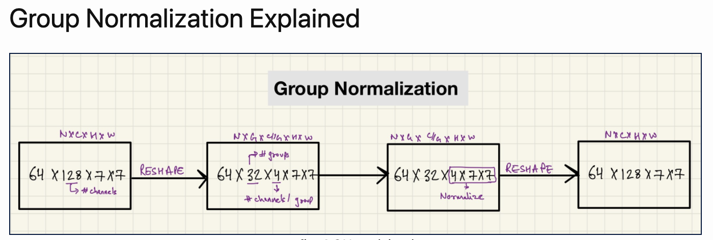

    If, G == 1, that is number of groups is set to 1, GN becomes LN.
  
 ### Calculation examples for three Normalization:
  
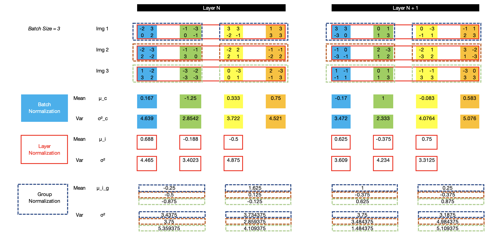

Here, in our example from excel sheet, we have 3 (2x2) images with 4 channels and Batch Size of 3.
  
* For BN, we will be calculating mean and variance along the channels and across the images
* For LN, we will be calculating mean and variance along the images
* For GN, we will be forming groups among the channels and we will be calculating mean and variance for these groups.

### Now let's about the Regressions,

Before diving into what is L1 and L2 Regression let's talk about Linear Regression.

Here,let's take an example

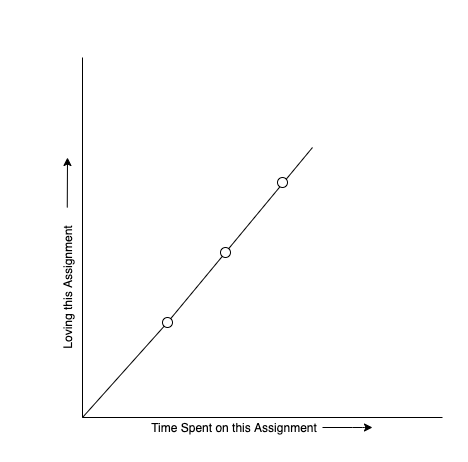

In the Image above we can see that the training data has 3 dataset, and it fits perfectly.
Now by sum of residuals (Cost Function) is given by 

```
Sum [ y - ÿ ]^2 = 0 
```

The answer is zero you may ask why ? cause the training dataset fits the line perfectly. 

Great !!! Now let's take a scenario where our training dataset overfits our model 

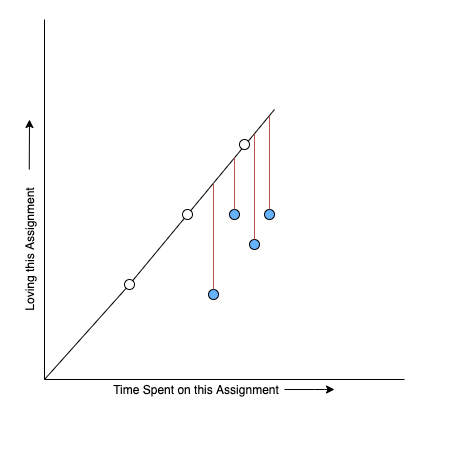

This above image in our training data points is overfitting meaning where my model is giving me wonderful results but it is for my training data which is giving me low error where as my test dataset is givin me high error. As we can see that the differance is huge to make my dataset fit perfectly with high variance.
 
### How can we minimize the difference and make our variance minimum

Here's where the Lasso and Ridge Regression kicks in,

### Let's start with Ridge Regression AKA L2 Regression

Here's an example,

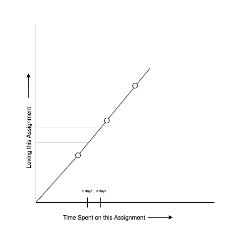

As we can see that the time spending on this assignment is having a steep slope on the Y-Axis because there is a huge movement in the X-Axis. Now its overfittig with the its slope and the cost function is 0.

##### Now lets look at how we can solve this by Rigde Regression and reduce the cost function, 

Formula is given by:
  
```
{ Sum [ y - ÿ ]^2 = 0 } + Lamda x (Slope)^2
```
where we can have the lamda value from 0 to any positve integer. as the lamda increses the slope becomes closer to 0.

Let's solve this by taking some random values,

<b>lamda = 1 and Slope = 1.5 and the Result would be 2.25</b>

Let's look at how are we gonna reduce the steep slope ? We can now introduce another slope,

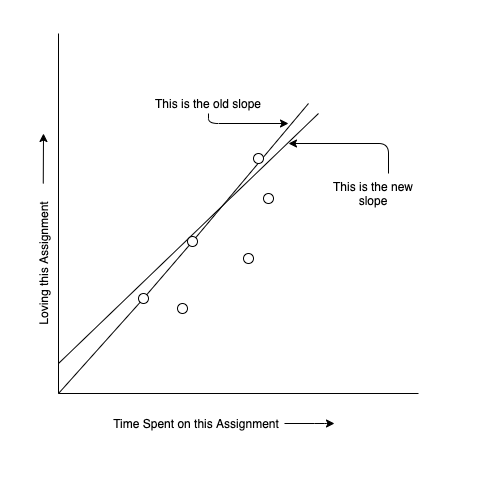

In the above image we can see that we have reduced the difference between the old line and the new line by adding a new slope

Let's solve this by taking some random values,
Where <b>lamda = 1 and Slope = 1.3 and the Result would be 1.69. which is less then the value we got from the first slope.</b> 

We can consider this new slope as our best fit line as the varience is decreased.


##### Now Coming to <b> Lasso Regression AKA L1 Regression </b>

There is just few changes compared to L2 Regression,

Formula is given by :
  
```
{ Sum [ y - ÿ ]^2 = 0 } + Lamda x |Slope|
```
where we can have the lamda value from 0 to 1 .As the lamda increses the slope becomes closer to 0 if it does then those features are removed.

Let's solve this by taking some random values,

Where **lamda = 1 and Slope = 1.5 and the Result would be 2.25.**

Let's look at how are we gonna reduce the steep slope ? We can now introduce another slope,


In the above image we can see that we have reduced the difference between the old line and the new line by adding a new slope

Let's solve this by taking some random values,

Where **lamda = 1 and Slope = 1.3 and the Result would be 1.69. which is less then the value we got from the first slope**

We can consider this new slope as our best fit line as the varience is decreased.

**Note** : Before considering which bestfit to choose we might have to run multiple iterations to come to a conclusion and choose bestfit for our model. 
  
## References:
  
  * Normalization Techniques ([https://arxiv.org/pdf/2009.12836.pdf](https://arxiv.org/pdf/2009.12836.pdf))
  * Group Normalization ([https://arxiv.org/pdf/1803.08494.pdf](https://arxiv.org/pdf/1803.08494.pdf))
  * Batch Normalization: Accelerating Deep Network Training by Reducing Internal Covariate Shift ([https://arxiv.org/pdf/1502.03167.pdf](https://arxiv.org/pdf/1502.03167.pdf))
  * (Layer Normalization) [https://arxiv.org/pdf/1607.06450.pdf](https://arxiv.org/pdf/1607.06450.pdf)
  

