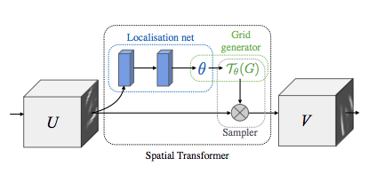

# CIFAR10 with Spatial Transformer
### This file is submitted as part of Assignment 12 for EVA6 Course.
## Contributors

* [Ammar Adil](https://github.com/adilsammar)
* [Krithiga](https://github.com/BottleSpink)
* [Shashwat Dhanraaj](https://github.com/sdhanraaj12)
* [Srikanth Kandarp](https://github.com/Srikanth-Kandarp)
---
## Table of Contents
  - [About the Model and Architechture](#about-the-model)
  - [Result](#result)
  - [References](#references)

---

## About the Model and Architechture   
* ## Introduction


  Spatial transformer networks are a generalization of differentiable attention to any spatial transformation. Spatial transformer networks (STN for short) allow a neural network to learn how to perform spatial transformations on the input image in order to enhance the geometric invariance of the model. For example, it can crop a region of interest, scale and correct the orientation of an image. It can be a useful mechanism because CNNs are not invariant to rotation and scale and more general affine transformations.

  One of the best things about STN is the ability to simply plug it into any existing CNN with very little modification. Spatial transformers can be incorporated into CNNs to benefit multifarious tasks:
  - Image classification: Suppose a CNN is trained to perform multi-way classification of images according to whether they contain a particular digit – where the position and size of the digit may vary significantly with each sample (and are uncorrelated with the class); a spatial transformer that crops out and scale normalizes the appropriate region can simplify the subsequent classification task, and lead to superior classification performance
  - Co-localisation: Given a set of images containing different instances of the same (but unknown) class, a spatial transformer can be used to localise them in each image
  - Spatial Attention: A key benefit of using attention is that transformed (and so attended), lower resolution inputs can be used in favour of higher resolution raw inputs, resulting in increased computational efficiency.
  
  ## Spatial Transformation Matrices:
  
  <image src='assets/Transformations.png'>
  
  - Affine Transformation:
    Affine Transformation helps to modify the geometric structure of the image, preserving parallelism of lines but not the lengths and angles. It preserves collinearity and ratios of distances. This technique is also used to correct Geometric Distortions and Deformations that occur with non-ideal camera angles. The Affine Transformation relies on matrices to handle rotation, shear, translation and scaling.
  - Projective Transformation:
    A projective transformation shows how the perceived objects change as the observer's viewpoint changes. These transformations allow the creating of perspective distortion. Projective transformations do not preserve parallelism, length, and angle.
  - Thin Plate Spline Transformation:
    A more flexible or higher degree of freedom of deformation or transformation can be achieved by TPS.
  
  Below animation shows the rotated MNIST:
    
   <image src='assets/AffineTPS.gif'>
    
  
  ## Spatial Transformers:
  
  This is a differentiable module which applies a spatial transformation to a feature map during a single forward pass, where the transformation is conditioned on the particular input, producing a single output feature map. For multi-channel inputs, the same warping is applied to each channel. The spatial transformer mechanism is split into three parts. 
  - In order of computation, first a localisation network takes the input feature map, and through a number of hidden layers outputs the parameters of the spatial transformation that should be applied to the feature map – this gives a transformation conditional on the input. 
  - Then, the predicted transformation parameters are used to create a sampling grid, which is a set of points where the input map should be sampled to produce the transformed output. This is done by the grid generator
  - Finally, the feature map and the sampling grid are taken as inputs to the sampler, producing the output map sampled from the input at the grid points 

  The combination of the localisation network, grid generator, and sampler form a spatial transformer. This is a self-contained module which can be dropped into a CNN architecture at any point, and in any number, giving rise to spatial transformer networks. This module is computationally very fast and does not impair the training speed, causing very little time overhead when used naively, and even speedups in attentive models due to subsequent downsampling that can be applied to the output of the transformer. Placing spatial transformers within a CNN allows the network to learn how to actively transform the feature maps to help minimise the overall cost function of the network during training. The knowledge of how to transform each training sample is compressed and cached in the weights of the localisation network (and also the weights of the layers previous to a spatial transformer) during training. For some tasks, it may also be useful to feed the output of the localisation network, θ, forward to the rest of the network, as it explicitly encodes the transformation, and hence the pose, of a region or object. It is also possible to use spatial transformers to downsample or oversample a feature map, as one can define the output dimensions H0 and W0 to be different to the input dimensions H and W. However, with sampling kernels with a fixed, small spatial support (such as the bilinear kernel), downsampling with a spatial transformer can cause aliasing effects.

  ```python
  # ==> Model <===
  # +--------------------------------------------------------------+
         self.localization = nn.Sequential(
         nn.Conv2d(3, 64, kernel_size=7),
         nn.MaxPool2d(2, stride=2),
         nn.ReLU(True),
         nn.Conv2d(64, 128, kernel_size=5),
         nn.MaxPool2d(2, stride=2),
         nn.ReLU(True)
        )

        # Regressor for the 3 * 2 affine matrix
        self.fc_loc = nn.Sequential(
            nn.Linear(128*4*4, 256),
            nn.ReLU(True),
            nn.Linear(256, 3 * 2)
        )

        # Initialize the weights/bias with identity transformation
        self.fc_loc[2].weight.data.zero_()
        self.fc_loc[2].bias.data.copy_(torch.tensor([1, 0, 0, 0, 1, 0], dtype=torch.float))

    # Spatial transformer network forward function
    def stn(self, x):
        xs = self.localization(x)
        xs = xs.view(-1, xs.size(1) * xs.size(2) * xs.size(3))
        theta = self.fc_loc(xs)
        theta = theta.view(-1, 2, 3)

        grid = F.affine_grid(theta, x.size(), align_corners=True)
        x = F.grid_sample(x, grid, align_corners=True)

        return x
  # +--------------------------------------------------------------+

  # ==> Visualizing the STN Results <===
  # +--------------------------------------------------------------+
  def visualize_stn():
    with torch.no_grad():
        # Get a batch of training data
        data = next(iter(test_loader))[0].to(device)

        input_tensor = data.cpu()
        transformed_input_tensor = model.stn(data).cpu()

        in_grid = convert_image_np(
            torchvision.utils.make_grid(input_tensor))

        out_grid = convert_image_np(
            torchvision.utils.make_grid(transformed_input_tensor))

        # Plot the results side-by-side
        f, axarr = plt.subplots(1, 2)
        axarr[0].imshow(in_grid)
        axarr[0].set_title('Dataset Images')

        axarr[1].imshow(out_grid)
        axarr[1].set_title('Transformed Images')

  for epoch in range(1, 20 + 1):
      train(epoch)
      test()
  # Visualize the STN transformation on some input batch
  visualize_stn()

  plt.ioff()
  plt.show()

  # +--------------------------------------------------------------+
  ```
* ## Depicting Spatial Transformer Networks
  Spatial transformer networks boils down to three main components :
  * The localization network is a regular CNN which regresses the transformation parameters. The transformation is never learned explicitly from this dataset, instead the network learns automatically the spatial transformations that enhances the global accuracy.
  * The grid generator generates a grid of coordinates in the input image corresponding to each pixel from the output image.
  * The sampler uses the parameters of the transformation and applies it to the input image.

  $~~~~~~~~~~~$
  <p align="center">
    
  </p>
  

--- 
## Results


---
## References 
1. https://github.com/jeonsworld/ViT-pytorch/blob/main/models/modeling.py
2. https://towardsdatascience.com/review-stn-spatial-transformer-network-image-classification-d3cbd98a70aa
