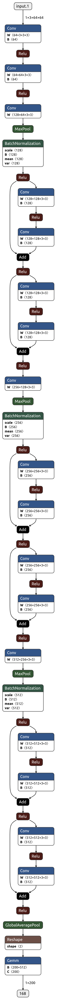
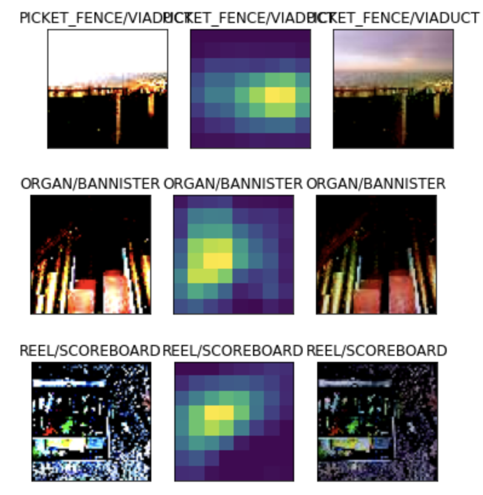
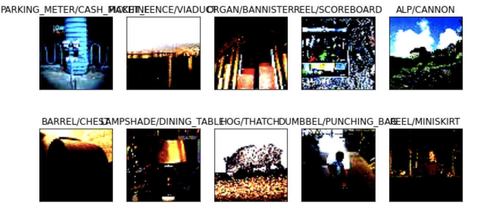

Tiny Imagenet

## Contributors

* [Ammar Adil](https://github.com/adilsammar)
* [Krithiga](https://github.com/BottleSpink)
* [Shashwat Dhanraaj](https://github.com/sdhanraaj12)
* [Srikanth Kandarp](https://github.com/Srikanth-Kandarp)
---

## Table of Contents
  - [Tiny Imagenet Dataset](#tiny-imagenet-dataset)
  - [About the Model](#about-the-model)
  - [Graphs](#graphs)
  - [Images](#images)
  - [References](#references)
----
## Introduction to Tiny Imagenet Dataset

<p> It is a smaller version derived from the monolith ImageNet challenge. The dataset consists of 100000 images of 200 classes (500 for each class) downsized to 64×64 colored images. Each class has 500 training images, and in total 1000 test images. The download is done using the script in the https://github.com/woolly-of-cv/pytorch-lib/tree/main/woollylib/dataset/tiny_imagenet </p>

### Preprocessing

<p> The labels text file consist of the class names. The folders consisting of the training images are then renamed to their respective class names. Custom dataset class is created to read the image and label and for image transforms. <p>


---
## About the Model

We used a custom Model in order to achive this accuracy with the implementation of bottleneck 

* ### Network Architechture

<p align="center">
  
</p>
 


* ### What is a BottleNeck ?

  A bottleneck layer is a layer that contains few nodes compared to the previous layers. It can be used to obtain a representation of the input with reduced dimensionality. An example of this is the use of autoencoders with bottleneck layers for nonlinear dimensionality reduction.The first several layers of this network, from the input up to some intermediate layer (say, the 𝑘 th layer, containing 𝑛𝑘 nodes). This subnetwork implements a mapping from the input space to an 𝑛𝑘-dimensional vector space. The 𝑘th layer is a bottleneck layer, so the vector of activations of nodes in the 𝑘th layer gives a lower dimensional representation of the input. The original network can't be used to classify new identities, on which it wasn't trained. But, the 𝑘th layer may provide a good representation of faces in general. So, to learn new identities, new classifier layers can be stacked on top of the 𝑘th layer and trained. Or, the new training data can be fed through the subnetwork to obtain representations from the 𝑘th layer, and these representations can be fed to some other classifier.

  ### BottleNeck Class
  ```python
  def _bottle_neck(self, inp, output):
        return nn.Sequential(
            WyConv2d(inp, output),
            nn.MaxPool2d(2),
            get_norm_layer(output, norm=self.norm),
            nn.ReLU()
        )
  ```
----
## Graphs:
  <p align="center">
  <image src='assets/TinyImagenet.png'>
</p>

---
    
## Gradcam Images:
    
<p align="center">
  
</p>
 
---
## Misclassified Predictions:

<p align="center">
  
</p>

---
## References:
  
 * https://ojs.aaai.org/index.php/AAAI/article/view/4302/4180
 * 

