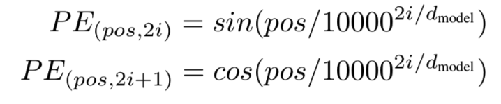

# Vision Transformers
### This file is submitted as part of Assignment 12 for EVA6 Course.
## Contributors

* [Ammar Adil](https://github.com/adilsammar)
* [Krithiga](https://github.com/BottleSpink)
* [Shashwat Dhanraaj](https://github.com/sdhanraaj12)
* [Srikanth Kandarp](https://github.com/Srikanth-Kandarp)
---
## Table of Contents
  - [About the Transformer](#about-the-model)
    - [Block Class](#block-class)
    - [Block Class](#block-class)
    - [Block Class](#block-class)
    - [Block Class](#block-class)
    
  - [References](#references)

---

* ## <b>Vision Transformer Classes</b>

 * ### <b>Introduction </b>
  
  <p align="center">
    
    <center><b>Overview Architechture</b></center>
  </p>
  
  ### Now lets take a peek inside how the transformer encoder works.

  <p align="center">
    
  </p>
  

  
  The input sequence consists of a flattened vector of pixel values extracted from a patch of size PxP. Each flattened element is fed into a linear projection layer that will produce what they call the “patch embeddings”. An extra learnable embedding is attached to the beginning of the sequence. This embedding, after being updated by self-attention, will be used to predict the class of the input image. A learnable positional embedding is also added to each of these embeddings.

  The classification is performed by just stacking an MLP Head on top of the Transformer, at the position of the extra learnable embedding that we added to the sequence.

  A hybrid architecture is also presented in this work. Instead of using projected image patches as input to the transformer, they use feature maps from the early stages of a ResNet. By training Transformers and this CNN backbone end-to-end, they achieve their best performances.

  * ### <b>Step 1: Block Class</b>

    * ### How it Works ?

  * ### <b>Step 2:Attention</b>

  
      <p align="center">
        
        <center><b>Dividing Images into Patches</b></center>
      </p>

      <p align="center">
        
        <center><b>Unrolling these patches into a sequence </b></center>
      </p>
  


    * ### How it Works ?

    Okay basically let's do global attention by simply going over image patches so we divide the image into these patches as you can see here and one patch is in this case something like 16 by 16. they unroll these patches into a sequence which is a first instance it's a set they combine this with a positional embedding so the transformers naturally they have no idea what what is where it's not like the transformer in a way is a generalization of an mlp of a feed-forward network in a feed-forward network what you have is you have you have just you have connections between these different inputs and outputs okay and these are fixed so the this node here will always attend to this node here with the weight that's specified by this particular connection however in a transformer this w isn't a fixed number in a transformer as the w is determined as they go and therefore is permutation and variant.

  * ### <b>Step 3:Embeddings </b>

      <p align="center">
        
        <center><b>Unrolling these patches into a sequence </b></center>
      </p>

    * ### How it Works ?

      The most important part that we need to understand is how to break down the image into patches. An image is represented as
      ```
      3D Image (X) ∈ resolution R^HxWxC 
      ```
      reshape the 3D image into flattened 2D patches
      ```
      Patch Image ( Xp)  ∈  R^(Nx(P^2 . C))
      ```
      Where sequence length ``` N = H . W / P^2 ```  and (P, P) is the resolution of each image patch.Each patch is a D dimension vector with a trainable linear projection.

      <b>[class] token</b> is Similar to BERT’s [class] token, we prepend a learnable embedding to the sequence of embedded patches ```(z00 = xclass )```.
      ```
      z0 = [xclass; x^1pE; x^2pE; · · · ; x^Np E] + Epos,    E ∈ R^((P^2C)×D), Epos ∈ R^((N+1)×D)

      X_class is a class label and (X^N)_p is patch images N ∈ 1 to n
      ```

      Using the transformer encoder to pre-train we always need a Class label at the 0th position. When we pass the patch images as inputs we always need to prepend one classification token as the first patch as shown in the figure.

      Now let's talk about positional embeddings,

      Since Transformers need to learn the inductive biases for the task they are being trained for, it is always beneficial to help that learning process by all means. Any inductive bias that we can include in the inputs of the model will facilitate its learning and improve the results.

      Position embeddings are added to the patch embeddings to retain positional information. In Computer Vision, these embeddings can represent either the position of a feature in a 1-dimensional flattened sequence or they can represent a 2-dimensional position of a feature.


      * 1-dimensional:  a sequence of patches, works better
      * 2-dimensional: X-embedding and Y-embedding

      <p align="center">
        
        <center><b>Position Embedding formula as per attention mechanism</b></center>
      </p>
  * ### <b>Step 4:Encoder</b>

      <p align="center">
        
      </p>

    * ### How it Works ?
      The Transformer encoder consists of alternating layers of multiheaded self- attention and MLP blocks. Layernorm (LN) is applied before every block, and residual connections after every block. The MLP contains two layers with a GELU non-linearity.

      <p align="center">
        
      </p>
      
      On an <b>Inductive bias</b> we note that Vision Transformer has much less image-specific inductive bias than CNNs. In CNNs, locality, two-dimensional neighborhood structure, and translation equivariance are baked into each layer throughout the whole model. In ViT, only MLP layers are local and transla- tionally equivariant, while the self-attention layers are global. The two-dimensional neighborhood structure is used very sparingly: in the beginning of the model by cutting the image into patches and at fine-tuning time for adjusting the position embeddings for images of different resolution (as de- scribed below). Other than that, the position embeddings at initialization time carry no information about the 2D positions of the patches and all spatial relations between the patches have to be learned from scratch.But the 
      <b>Hybrid Architecture</b> is an alternative to raw image patches, the input sequence can be formed from feature maps of a CNN. In this model, the patch embedding projection E (Eq. 1) is applied to patches extracted from a CNN feature map. As a special case, the patches can have spatial size 1x1, which means that the input sequence is obtained by simply flattening the spatial dimensions of the feature map and projecting to the Transformer dimension. The classification input embedding and position embeddings are added as described above.


  * ### <b>Step 4:MLP aka Multi-Layer Perceptron </b>


      <p align="center">
        
        <center><b>Multilayer Perceptron (MLP) and the Output</b></center>
      </p>

    * ### How it Works ?
      A multilayer perceptron (MLP) is a feedforward artificial neural network that generates a set of outputs from a set of inputs. An MLP is characterized by several layers of input nodes connected as a directed graph between the input and output layers. MLP uses backpropogation for training the network. MLP is a deep learning method. As the neural network connecting multiple layers in a directed graph, which means that the signal path through the nodes only goes one way. Each node, apart from the input nodes, has a nonlinear activation function and that predicts that the image that we feed was <b>Rohan</b> as a class.


## Referances 
1. https://github.com/jeonsworld/ViT-pytorch/blob/main/models/modeling.py
2. https://www.analyticsvidhya.com/blog/2021/03/an-image-is-worth-16x16-words-transformers-for-image-recognition-at-scale-vision-transformers/
3. https://www.youtube.com/watch?v=TrdevFK_am4
4. https://openreview.net/forum?id=YicbFdNTTy
   