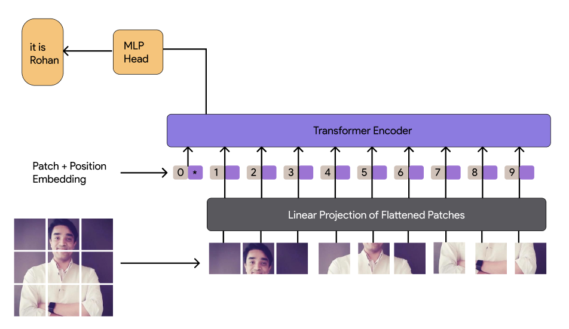
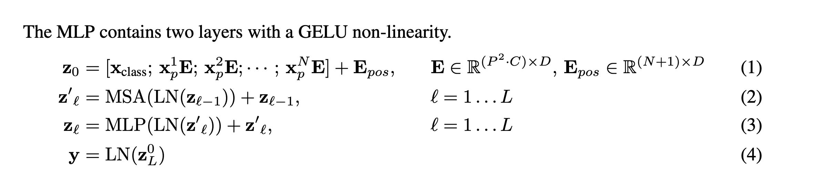
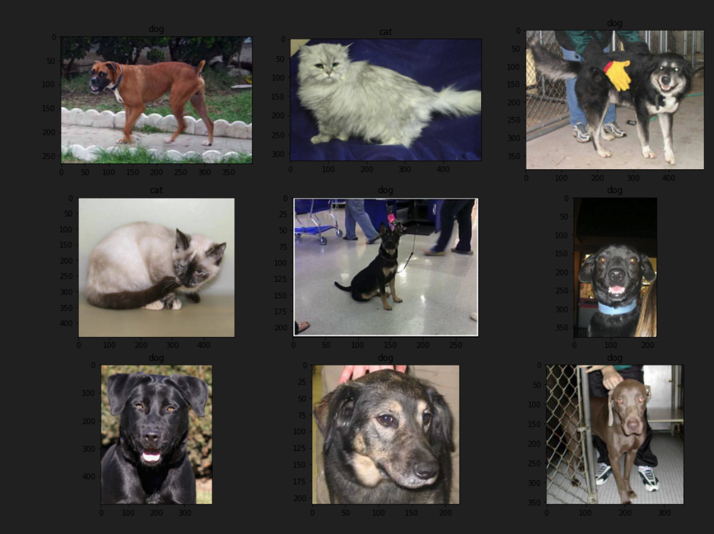
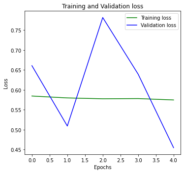

# Classifying Dogs and Cats with Vision Transformers

### This file is submitted as part of Assignment 13 for EVA 6 Course.


## Table of Contents

  - [Diving Deep into Vision Transformers](#diving-deep-into-vision-transformers)
  - [ViT Deeply Explanined](#Wait-!!-We-should-divive-deep-into-what-each-class-does-in-vision-transformer)
  - [Results](#results)
  - [Referances](#referances)


## Diving Deep into Vision Transformers

* ### <b>Revisiting the Theory </b>

    
  <p align="center">
    
    <b>Overview Architechture</b><br>
  </p>
  
  Let's take the same architechture that we periously did and with rohan's photo. An overview of the model is shown in the figure above. The standard Transformer receives as input a 1D
  sequence of token embeddings. To handle 2D images, we reshape the image x ∈ RH×W×C into a sequence of flattened 2D patches ```xp ∈ RN×(P2·C)```, where ```(H,W)``` is the resolution of the original
  image,Cisthenumberofchannels,```(P,P)```istheresolutionofeachimagepatch,andN =HW/P2 is the resulting number of patches, which also serves as the effective input sequence length for the Transformer. The Transformer uses constant latent vector size D through all of its layers, so we flatten the patches and map to D dimensions with a trainable linear projection (Eq. 1). We refer to the output of this projection as the patch embeddings.
  
  Similar to BERT’s [class] token, we prepend a learnable embedding to the sequence of embed- ded patches ```(z0 = xclass)```, whose state at the output of the Transformer encoder ```(z0L)``` serves as the image representation y. Both during pre-training and fine-tuning, a classification head is at- tached to z0L. The classification head is implemented by a MLP with one hidden layer at pre-training time and by a single linear layer at fine-tuning time.

  Position embeddings are added to the patch embeddings to retain positional information. We use standard learnable 1D position embeddings, since we have not observed significant performance gains from using more advanced 2D-aware position embeddings. The resulting sequence of embedding vectors serves as input to the encoder.

  The MLP contains two layers with a GELU non-linearity.
  <p align="center">
    

  </p>


  * ### Inductive Bias

    Inductive bias. We note that Vision Transformer has much less image-specific inductive bias than CNNs. In CNNs, locality, two-dimensional neighborhood structure, and translation equivariance are baked into each layer throughout the whole model. In ViT, only MLP layers are local and transla- tionally equivariant, while the self-attention layers are global. The two-dimensional neighborhood structure is used very sparingly: in the beginning of the model by cutting the image into patches and at fine-tuning time for adjusting the position embeddings for images of different resolution (as de- scribed below). Other than that, the position embeddings at initialization time carry no information about the 2D positions of the patches and all spatial relations between the patches have to be learned from scratch.

  * ### Hybrid Architecture

    As an alternative to raw image patches, the input sequence can be formed from feature maps of a CNN . In this hybrid model, the patch embedding projection ```E``` (from Eq 1) is applied to patches extracted from a CNN feature map. As a special case, the patches can have spatial size ```1x1```, which means that the input sequence is obtained by simply flattening the spatial dimensions of the feature map and projecting to the Transformer dimension. The classification input embedding and position embeddings are added as described above.

 * ### <b> Wait !! We should divive deep into what each class does in vision transformer shouldn't we ? Yes.</b>

    ### Dataset we will be using is Cat's and Dog's and classifying using vison transformer
   
    https://www.kaggle.com/c/dogs-vs-cats-redux-kernels-edition/data

    We can download the dataset from the above link.

    Here we will be implementing the Vision Transformers with PyTorch. 

    To install the ViT PyTorch package and Linformer 
    ```python
    pip install vit-pytorch linformer
    ```
    1. ### Loading Libraries

    ```python
    import os
    import random
    import numpy as np
    import pandas as pd
    import matplotlib.pyplot as plt  
    ```

    2. ### Import Linformer
    ```python
    from linformer import Linformer   
    import glob   
    from PIL import Image
    from itertools import chain   
    from vit_pytorch.efficient import ViT   
    from tqdm.notebook import tqdm   
    from __future__ import print_function
    ```
    3. ### Import torch and related libraries 
    ```python
    import torch   
    import torch.nn as nn
    import torch.optim as optim
    import torch.nn.functional as F
    from torchvision import datasets, transforms   
    from torch.optim.lr_scheduler import StepLR   
    from torch.utils.data import DataLoader, Dataset
    ```

    4. ### To unzip the datasets
    ```python
    import zipfile   
    ```
    5. ### Sklearn to split the data
    ```python

    from sklearn.model_selection import train_test_split  
    ```

    6. ### Definining batch size, epocs, learning rate and gamma for training  
    ```python
    batch_size = 64
    epochs = 20
    lr = 3e-5
    gamma = 0.7
    ```

    7. ### For learning rate scheduler & to load data

    ```python
    os.makedirs('data', exist_ok=True)
    train_dir = 'data/train'
    test_dir = 'data/test'
    ```

    8. ### Unzipping dataset
    ```python
    with zipfile.ZipFile('train.zip') as train_zip:
        train_zip.extractall('data')

    with zipfile.ZipFile('test.zip') as test_zip:
        test_zip.extractall('data')
    ```

    9. ### Creating train and test list 
    ```python
    train_list = glob.glob(os.path.join(train_dir,'*.jpg'))
    test_list = glob.glob(os.path.join(test_dir, '*.jpg'))
    ```
    10. ### Printing length of the dataset
    ```python
    print(f"Train Data: {len(train_list)}")
    print(f"Test Data: {len(test_list)}")
    ```
    11. ### Defining labels

    ```python
    labels = [path.split('/')[-1].split('.')[0] for path in train_list]
    ```
    12. ### Printing few images 

    ```python
    random_idx = np.random.randint(1, len(train_list), size=9)
    fig, axes = plt.subplots(3, 3, figsize=(16, 12))
    for idx, ax in enumerate(axes.ravel()):
        img = Image.open(train_list[idx])
        ax.set_title(labels[idx])
        ax.imshow(img)
    ```
    <p align="center">
        

    </p>

    13. ### Splitting train and validation list
    ```python
    train_list, valid_list = train_test_split(train_list, 
                                              test_size=0.2,
                                              stratify=labels,
                                              random_state=seed)
    print(f"Train Data: {len(train_list)}")
    print(f"Validation Data: {len(valid_list)}")
    print(f"Test Data: {len(test_list)}")
    ```
    14. ### Torch transforms
    ```python
    train_transforms = transforms.Compose(
        [
            transforms.Resize((224, 224)),
            transforms.RandomResizedCrop(224),
            transforms.RandomHorizontalFlip(),
            transforms.ToTensor(),
        ]
    )
    val_transforms = transforms.Compose(
        [
            transforms.Resize((224, 224)),
            transforms.RandomResizedCrop(224),
            transforms.RandomHorizontalFlip(),
            transforms.ToTensor(),
        ]
    )
    test_transforms = transforms.Compose(
        [
            transforms.Resize((224, 224)),
            transforms.RandomResizedCrop(224),
            transforms.RandomHorizontalFlip(),
            transforms.ToTensor(),
        ]
    )
    ```
    15. ### Loading dataset for training 
    ```python
    class CatsDogsDataset(Dataset):
        def __init__(self, file_list, transform=None):
            self.file_list = file_list
            self.transform = transform
        def __len__(self):
            self.filelength = len(self.file_list)
            return self.filelength
        def __getitem__(self, idx):
            img_path = self.file_list[idx]
            img = Image.open(img_path)
            img_transformed = self.transform(img)
            label = img_path.split("/")[-1].split(".")[0]
            label = 1 if label == "dog" else 0
            return img_transformed, label
    ```
    16. ### defining train, validation and test dataset
    ```python
    train_data = CatsDogsDataset(train_list, transform=train_transforms)
    valid_data = CatsDogsDataset(valid_list, transform=test_transforms)
    test_data = CatsDogsDataset(test_list, transform=test_transforms)
    ```
    17. ### loading dataloader
    ```python
    train_loader = DataLoader(dataset = train_data, batch_size=batch_size, shuffle=True )
    valid_loader = DataLoader(dataset = valid_data, batch_size=batch_size, shuffle=True)
    test_loader = DataLoader(dataset = test_data, batch_size=batch_size, shuffle=True)
    ```
    18. ### Line transformer 
    ```python
    efficient_transformer = Linformer(
        dim=128,
        seq_len=49+1,  # 7x7 patches + 1 cls-token
        depth=12,
        heads=8,
        k=64
    )
    ```
    19. ### Visual transformer 
    ```python
    model = ViT(
        dim=128,
        image_size=224,
        patch_size=32,
        num_classes=2,
        transformer=efficient_transformer,
        channels=3,
    ).to(device)
    ```
    20. ### loss function
    ```python
    criterion = nn.CrossEntropyLoss()
    ```
    21. ### optimizer
    ```python
    optimizer = optim.Adam(model.parameters(), lr=lr)
    ```
    22. ### scheduler
    ```python
    scheduler = StepLR(optimizer, step_size=1, gamma=gamma)
    ```
    23. ### start training
    ```python
    for epoch in range(epochs):
        epoch_loss = 0
        epoch_accuracy = 0
        for data, label in tqdm(train_loader):
            data = data.to(device)
            label = label.to(device)
            output = model(data)
            loss = criterion(output, label)
            optimizer.zero_grad()
            loss.backward()
            optimizer.step()
            acc = (output.argmax(dim=1) == label).float().mean()
            epoch_accuracy += acc / len(train_loader)
            epoch_loss += loss / len(train_loader)
        with torch.no_grad():
            epoch_val_accuracy = 0
            epoch_val_loss = 0
            for data, label in valid_loader:
                data = data.to(device)
                label = label.to(device)
                val_output = model(data)
                val_loss = criterion(val_output, label)
                acc = (val_output.argmax(dim=1) == label).float().mean()
                epoch_val_accuracy += acc / len(valid_loader)
                epoch_val_loss += val_loss / len(valid_loader)
        print(
            f"Epoch : {epoch+1} - loss : {epoch_loss:.4f} - acc: {epoch_accuracy:.4f} - val_loss : {epoch_val_loss:.4f} - val_acc: {epoch_val_accuracy:.4f}\n"
        )
    ```
## Results 

* ### Graph 

  <p align="center">
    

  </p>


* ### Training Logs
```
Epoch : 1  - loss : 0.6969 - acc: 0.5008 - val_loss : 0.6910 - val_acc: 0.5384 
Epoch : 2  - loss : 0.6898 - acc: 0.5303 - val_loss : 0.6881 - val_acc: 0.5419
Epoch : 3  - loss : 0.6832 - acc: 0.5568 - val_loss : 0.6890 - val_acc: 0.5506
Epoch : 4  - loss : 0.6763 - acc: 0.5739 - val_loss : 0.6704 - val_acc: 0.5809
Epoch : 5  - loss : 0.6695 - acc: 0.5852 - val_loss : 0.6645 - val_acc: 0.5961
Epoch : 6  - loss : 0.6608 - acc: 0.5971 - val_loss : 0.6620 - val_acc: 0.6058
Epoch : 7  - loss : 0.6479 - acc: 0.6149 - val_loss : 0.6439 - val_acc: 0.6187
Epoch : 8  - loss : 0.6421 - acc: 0.6218 - val_loss : 0.6471 - val_acc: 0.6147
Epoch : 9  - loss : 0.6318 - acc: 0.6356 - val_loss : 0.6284 - val_acc: 0.6394
Epoch : 10 - loss : 0.6223 - acc: 0.6499 - val_loss : 0.6231 - val_acc: 0.6363
Epoch : 11 - loss : 0.6192 - acc: 0.6492 - val_loss : 0.6182 - val_acc: 0.6547
Epoch : 12 - loss : 0.6154 - acc: 0.6524 - val_loss : 0.6233 - val_acc: 0.6386
Epoch : 13 - loss : 0.6069 - acc: 0.6648 - val_loss : 0.6169 - val_acc: 0.6578
Epoch : 14 - loss : 0.6017 - acc: 0.6687 - val_loss : 0.6111 - val_acc: 0.6527
Epoch : 15 - loss : 0.6000 - acc: 0.6710 - val_loss : 0.6247 - val_acc: 0.6379
Epoch : 16 - loss : 0.5942 - acc: 0.6770 - val_loss : 0.6039 - val_acc: 0.6630
Epoch : 17 - loss : 0.5895 - acc: 0.6794 - val_loss : 0.6088 - val_acc: 0.6650
Epoch : 18 - loss : 0.5916 - acc: 0.6750 - val_loss : 0.6048 - val_acc: 0.6620
Epoch : 19 - loss : 0.5847 - acc: 0.6829 - val_loss : 0.6185 - val_acc: 0.6570
Epoch : 20 - loss : 0.5807 - acc: 0.6879 - val_loss : 0.6064 - val_acc: 0.6695
```

## Referances
1. https://arxiv.org/abs/2010.11929v2
2. https://analyticsindiamag.com/hands-on-vision-transformers-with-pytorch/

