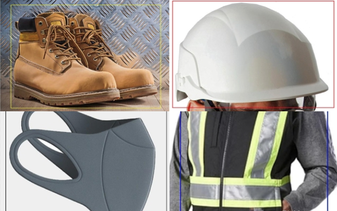

# YoloV3 with Custom Dataset ? Yes.

### This file is submitted as part of Assignment 11 for EVA6 Course.


## Contributors

* [Ammar Adil](https://github.com/adilsammar)
* [Krithiga](https://github.com/BottleSpink)
* [Shashwat Dhanraaj](https://github.com/sdhanraaj12)
* [Srikanth Kandarp](https://github.com/Srikanth-Kandarp)

## Table of Contents

  * [Model and Architecture](#model-and-architecture)
    + [What is YOLOv3 ?](#-b-what-is-yolov3---b-)
    + [How does YOLOv3 work in an nutshell ?](#-b-how-does-yolov3-work-in-an-nutshell---b-)
    + [Let's understand the architecture of YOLOv3](#-b-let-s-understand-the-architecture-of-yolov3--b-)
    + [How is it any better then YOLOv2 ?](#-b-how-is-it-any-better-then-yolov2----b-)
  * [How to prepare your Custom Dataset ?](#how-to-prepare-your-custom-dataset--)
    + [Working with BBoxes](#working-with-bboxes)
    + [How would it work ?](#-b-how-would-it-work----b-)
  * [Results](#results)
    + [Images](#images)
    + [Video](#video)
  * [References](#references)

## Model and Architecture

* ### <b>What is YOLOv3?</b>

    YOLOv3 (You Only Look Once, Version 3) is a real-time object detection algorithm that identifies specific objects in videos, live feeds, or images. YOLO uses features learned by a deep convolutional neural network to detect an object. Versions 1-3 of YOLO were created by Joseph Redmon and Ali Farhadi.

    The first version of YOLO was created in 2016, and version 3, which is discussed extensively in this article, was made two years later in 2018. YOLO is implemented using the Keras or OpenCV deep learning libraries.


* ### <b>How does YOLOv3 work in an nutshell?</b>
  
    YOLO is a Convolutional Neural Network (CNN) for performing object detection in real-time. CNNs are classifier-based systems that can process input images as structured arrays of data and identify patterns between them. YOLO has the advantage of being much faster than other networks and still maintains accuracy as it allows the model to look at the whole image at test time, so its predictions are informed by the global context in the image. YOLO and other convolutional neural network algorithms “score” regions based on their similarities to predefined classes.

    High-scoring regions are noted as positive detections of whatever class they most closely identify with. For example, in a live feed of traffic, YOLO can be used to detect different kinds of vehicles depending on which regions of the video score highly in comparison to predefined classes of vehicles

* ### <b>Let's understand the architecture of YOLOv3</b>
    The YOLOv3 algorithm first separates an image into a grid. Each grid cell predicts some number of boundary boxes (sometimes referred to as anchor boxes) around objects that score highly with the aforementioned predefined classes.

    Each boundary box has a respective confidence score of how accurate it assumes that prediction should be and detects only one object per bounding box. The boundary boxes are generated by clustering the dimensions of the ground truth boxes from the original dataset to find the most common shapes and sizes.

    Other comparable algorithms that can carry out the same objective are R-CNN (Region-based Convolutional Neural Networks made in 2015) and Fast R-CNN (R-CNN improvement developed in 2017), and Mask R-CNN.

    However, unlike systems like R-CNN and Fast R-CNN, YOLO is trained to do classification and bounding box regression at the same time.

    <figure align="center">
        
        <font size="2">
        </figcaption>
        </font>
    </figure>

 <h4 align="center">YOLOv3 Architechture</h4>
 
 
```bash
                            ┌────────────┬────────────────────────┬───────────────────┐
                            │    Name    │        Filters         │ Output Dimension  │
                            ├────────────┼────────────────────────┼───────────────────┤
                            │ Conv 1     │ 7 x 7 x 64, stride=2   │ 224 x 224 x 64    │
                            │ Max Pool 1 │ 2 x 2, stride=2        │ 112 x 112 x 64    │
                            │ Conv 2     │ 3 x 3 x 192            │ 112 x 112 x 192   │
                            │ Max Pool 2 │ 2 x 2, stride=2        │ 56 x 56 x 192     │
                            │ Conv 3     │ 1 x 1 x 128            │ 56 x 56 x 128     │
                            │ Conv 4     │ 3 x 3 x 256            │ 56 x 56 x 256     │
                            │ Conv 5     │ 1 x 1 x 256            │ 56 x 56 x 256     │
                            │ Conv 6     │ 1 x 1 x 512            │ 56 x 56 x 512     │
                            │ Max Pool 3 │ 2 x 2, stride=2        │ 28 x 28 x 512     │
                            │ Conv 7     │ 1 x 1 x 256            │ 28 x 28 x 256     │
                            │ Conv 8     │ 3 x 3 x 512            │ 28 x 28 x 512     │
                            │ Conv 9     │ 1 x 1 x 256            │ 28 x 28 x 256     │
                            │ Conv 10    │ 3 x 3 x 512            │ 28 x 28 x 512     │
                            │ Conv 11    │ 1 x 1 x 256            │ 28 x 28 x 256     │
                            │ Conv 12    │ 3 x 3 x 512            │ 28 x 28 x 512     │
                            │ Conv 13    │ 1 x 1 x 256            │ 28 x 28 x 256     │
                            │ Conv 14    │ 3 x 3 x 512            │ 28 x 28 x 512     │
                            │ Conv 15    │ 1 x 1 x 512            │ 28 x 28 x 512     │
                            │ Conv 16    │ 3 x 3 x 1024           │ 28 x 28 x 1024    │
                            │ Max Pool 4 │ 2 x 2, stride=2        │ 14 x 14 x 1024    │
                            │ Conv 17    │ 1 x 1 x 512            │ 14 x 14 x 512     │
                            │ Conv 18    │ 3 x 3 x 1024           │ 14 x 14 x 1024    │
                            │ Conv 19    │ 1 x 1 x 512            │ 14 x 14 x 512     │
                            │ Conv 20    │ 3 x 3 x 1024           │ 14 x 14 x 1024    │
                            │ Conv 21    │ 3 x 3 x 1024           │ 14 x 14 x 1024    │
                            │ Conv 22    │ 3 x 3 x 1024, stride=2 │ 7 x 7 x 1024      │
                            │ Conv 23    │ 3 x 3 x 1024           │ 7 x 7 x 1024      │
                            │ Conv 24    │ 3 x 3 x 1024           │ 7 x 7 x 1024      │
                            │ FC 1       │ -                      │ 4096              │
                            │ FC 2       │ -                      │ 7 x 7 x 30 (1470) │
                            └────────────┴────────────────────────┴───────────────────┘
```

* ### <b>How is it any better then YOLOv2 ?</b>

    YOLOv2 was using Darknet-19 as its backbone feature extractor, while YOLOv3 now uses Darknet-53. Darknet-53 is a backbone also made by the YOLO creators Joseph Redmon and Ali Farhadi.

    Darknet-53 has 53 convolutional layers instead of the previous 19, making it more powerful than Darknet-19 and more efficient than competing backbones (ResNet-101 or ResNet-152).


    |   Top-1	|   Top-1	|   Top-5		|    Ops	|    BFLOPS/s	|    FPS   |
    |---	   |---	|---	|---	|---	|----   |
    |Darknet-19|74.1   	|   91.8	|   7.29	|   1246	|   171    |
    |ResNet-101|   77.1	|   93.7	|   19.7	|   1039	|      53 |
    |ResNet-152|  77.6 	|   93.8	|   	29.4|   1090	|     37  |
    |Darknet-53|  77.2 	|   93.8	|   18.7	|   1357	|    28   |


    <figure align="center">
        <figcaption> <b>Comparison of backbones. Accuracy, billions of operations (Ops), billion floating-point operations per second (BFLOP/s), and frames per second (FPS) for various networks</b>
        </figcaption>
        </font>
    </figure>


    YOLOv3 is fast and accurate in terms of mean average precision (mAP) and intersection over union (IOU) values as well. It runs significantly faster than other detection methods with comparable performance (hence the name – You only look once).

    Moreover, you can easily trade-off between speed and accuracy simply by changing the model’s size, and no retraining required.

   <p align="center">
       
   </p>


<h4 align="center">YOLOv3 Performance</h4>

## How to prepare your Custom Dataset ? 

### Classes that we worked with in our custom dataset are
    
    
    - Hardhats 
    - Vests
    - Marks 
    - Boots
        
* ### Working with BBoxes
    The first step to understanding YOLO is how it encodes its output. The input image is divided into an S x S grid of cells. For each object that is present on the image, one grid cell is said to be “responsible” for predicting it. That is the cell where the center of the object falls into.
    Each grid cell predicts B bounding boxes as well as C class probabilities. The bounding box prediction has 5 components: (x, y, w, h, confidence). The (x, y) coordinates represent the center of the box, relative to the grid cell location (remember that, if the center of the box does not fall inside the grid cell, than this cell is not responsible for it). These coordinates are normalized to fall between 0 and 1. The (w, h) box dimensions are also normalized to [0, 1], relative to the image size. Let’s look at an example:


   <p align="center">
       
   </p>
  <h4 align="center">Annotations of the Custom Class</h4>


    It is also necessary to predict the class probabilities, Pr(Class(i) | Object). This probability is conditioned on the grid cell containing one object (see this if you don’t know that conditional probability means). In practice, it means that if no object is present on the grid cell, the loss function will not penalize it for a wrong class prediction, as we will see later. The network only predicts one set of class probabilities per cell, regardless of the number of boxes B. That makes S x S x C class probabilities in total

    Adding the class predictions to the output vector, we get a ```S x S x (B * 5 +C)``` tensor as output.


* ### <b>How would it work ?</b>
   *  <b>Precision for Small Objects</b>

        The precision for small objects in YOLOv2 was incomparable to other algorithms because of how inaccurate YOLO was at detecting small objects. With an AP of 5.0, it paled compared to other algorithms like RetinaNet (21.8) or SSD513 (10.2), which had the second-lowest AP for small objects.

        <p align="center">
            
        </p>
       <h4 align="center">YOLOv3 comparison for different object sizes showing the average precision (AP) for AP-S (small object size), AP-M (medium object size), AP-L (large object size</h4>

        The chart above shows the average precision (AP) of detecting small, medium, and large images with various algorithms and backbones. The higher the AP, the more accurate it is for that variable.

        The new YOLOv3 uses independent logistic classifiers and binary cross-entropy loss for the class predictions during training. These edits make it possible to use complex datasets such as Microsoft’s Open Images Dataset (OID) for YOLOv3 model training. OID contains dozens of overlapping labels, such as “man” and “person” for images in the dataset.

        YOLOv3 uses a multilabel approach which allows classes to be more specific and be multiple for individual bounding boxes. Meanwhile, YOLOv2 used a softmax, which is a mathematical function that converts a vector of numbers into a vector of probabilities, where the probabilities of each value are proportional to the relative scale of each value in the vector.

        Using a softmax makes it so that each bounding box can only belong to one class, which is sometimes not the case, especially with datasets like OID.

        In YOLOv3 and its other versions, the way this prediction map is interpreted is that each cell predicts a fixed number of bounding boxes. Then, whichever cell contains the center of the ground truth box of an object of interest is designated as the cell that will be finally responsible for predicting the object. There is a ton of mathematics behind the inner workings of the prediction architecture.

       * ### Anchor Boxes


            Although anchor boxes, or bounding boxes, were discussed a little bit at the beginning of this article, there is a bit more detail about implementing them and using them with YOLOv3. Object detectors using YOLOv3 usually predict log-space transforms, which are offsets to predefined “default” bounding boxes. Those specific bounding boxes are called anchors. The transforms are later applied to the anchor boxes to receive a prediction.YOLOv3 in particular has three anchors. This results in the prediction of three bounding boxes per cell (the cell is also called a neuron in more technical terms).
       * ### Non-Maximum Suppression

            Objects can sometimes be detected multiple times when more than one bounding box detects the object as a positive class detection. Non-maximum suppression helps avoid this situation and only passes detections if they haven’t already been detected. Using the NMS threshold value and confidence threshold value, NMS is implemented to prevent double detections. It is an imperative part of using YOLOv3 effectively. Here, we briefly described a few of the features that make the predictions possible, such as anchor boxes and non-maximum suppression (NMS) values. This is, however, not a complete representation of all the features that go into creating a successful prediction with YOLOv3. 

## Results

* ### Images 

    <p align="center">
      
    </p>

    <p align="center">
      
    </p>

    <p align="center">
      
    </p>
* ### Videos


## Referances 

1. https://arxiv.org/abs/1804.02767
2. https://viso.ai/deep-learning/yolov3-overview/
3. https://pjreddie.com/media/files/papers/YOLOv3.pdf
4. https://paperswithcode.com/method/yolov3
   
